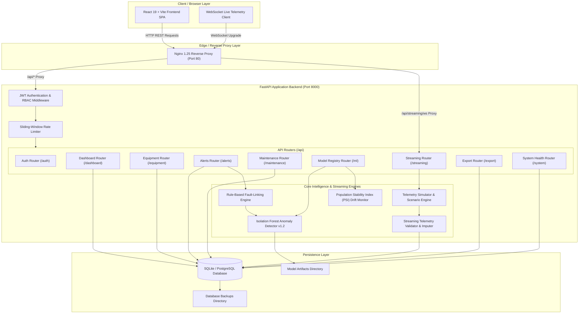

# ⚡ EnergyIQ — Commercial Campus Energy Intelligence & Predictive Maintenance Platform

[](file:///E:/coe%20project/docs/testing.md)
[-success.svg)](file:///E:/coe%20project/frontend)
[](https://www.python.org/)
[](https://fastapi.tiangolo.com/)
[](https://react.dev/)
[](LICENSE)
[](file:///E:/coe%20project/reports/project_completion_matrix.md)

> **AI-Powered Campus Energy Monitoring, Real-Time WebSocket Telemetry Streaming, Context-Aware Isolation Forest Anomaly Detection, ML Model Registry, PSI Drift Monitoring, Fault Linking, and Predictive Maintenance SaaS Platform**

---

## 📌 Executive Summary

**EnergyIQ** is an enterprise-grade full-stack SaaS platform designed for commercial facility management, university campuses, and industrial sites operating multi-source microgrids (**Solar PV, Battery Storage, Grid Supply**) and critical equipment assets.

The platform bridges statistical machine learning anomaly detection with physical equipment fault correlation and predictive maintenance work order management. It processes high-frequency telemetry, computes contextual rolling baselines, classifies root-cause physical faults, alerts operators via severity inbox triage, and dispatches work orders to technicians before costly equipment breakdown occurs.

---

## 🌟 Key Features & Capabilities

### 🔐 Authentication & Role-Based Access Control (RBAC)
- **Stateless JWT Security**: Passwords hashed using PBKDF2-HMAC-SHA256 with 100,000 iterations and unique 16-byte random salts.
- **Enforced Roles**: 3 pre-seeded role tiers (`ADMIN`, `FACILITY_OPERATOR`, `TECHNICAL_ENGINEER`) with route guard middleware in both backend APIs and React frontend navigation.

### 📡 Telemetry Ingestion & WebSocket Streaming Engine
- **Microgrid Telemetry**: Ingests energy kWh, temperature (°C), operating state (`ON`/`OFF`/`DEGRADED`), production context output, solar generation, battery state-of-charge (SoC), and grid consumption.
- **10 Telemetry Degradation Scenarios**: Real-time simulation of `NORMAL_TELEMETRY`, `MISSING_PACKET`, `DELAYED_PACKET`, `DUPLICATE_PACKET`, `OUT_OF_ORDER_PACKET`, `SENSOR_MALFUNCTION`, `SUDDEN_POWER_SPIKE`, `GRADUAL_POWER_DRIFT`, `EXTREME_TEMPERATURE`, and `BURST_TRAFFIC`.

### 🤖 ML Anomaly Detection, Model Registry & PSI Drift Monitoring
- **Context-Aware Isolation Forest v1.2**: Scikit-Learn `IsolationForest` pipeline evaluating rolling 24h mean, standard deviation, temperature delta, and production context ratios.
- **Model Registry & Rollback**: Manage deployed algorithms (`mod-cif-v120`, `mod-zscore-v100`, `mod-lof-v090`) with atomic activation and instant rollback endpoint (`POST /api/ml/models/{id}/rollback`).
- **Population Stability Index (PSI)**: Statistical distribution drift monitoring comparing live streaming telemetry against baseline training distributions.

### 🔗 Root-Cause Fault Linking & Alert Triage
- **10 Physical Fault Categories**: Maps anomaly scores to physical root causes (`MECHANICAL_RESISTANCE`, `REFRIGERANT_LEAK`, `SHORT_CYCLING`, `THERMAL_OVERHEATING`, `BEARING_WEAR`, `SENSOR_CALIBRATION_DRIFT`, `CAPACITOR_DEGRADATION`, `INSULATION_FAILURE`, `BELT_SLIPPAGE`, `FILTER_CLOGGING`).
- **Co-Occurring Alert Correlation**: Clusters co-occurring alerts across facility cooling and production lines to isolate cascade failures.

### 🛠️ Predictive Maintenance & Operational Data Export
- **One-Click Work Order Dispatch**: Convert active alerts directly into maintenance tickets assigned to technicians (`Rajesh Kumar`, `On-Call Maintenance Tech`).
- **Data Export Service**: Endpoint `/api/export/{resource}` exporting operational telemetry, alerts, and work orders in CSV and JSON formats.

---

## 🗝️ Pre-Seeded System Credentials

| Username | Password | Role | Access Level & Scope |
| :--- | :--- | :--- | :--- |
| `admin` | `admin123` | `ADMIN` | Full access to all 16 view modules, Model Registry activation/rollback, settings, user management, and demo panel. |
| `operator` | `operator123` | `FACILITY_OPERATOR` | Access to Overview, Live Energy, Equipment, Alert Center, Maintenance work orders, Streaming Health, and Reports. |
| `engineer` | `engineer123` | `TECHNICAL_ENGINEER` | Access to Equipment, Alerts, Analytics, AI Insights, ML Evaluation, Benchmark ML, Data Quality, Model Registry, and Edge Cases. |

---

## 🏗️ System Architecture



---

## 🛠️ Technology Stack

| Component | Technology | Description |
| :--- | :--- | :--- |
| **Frontend SPA** | React 19, Vite, Tailwind CSS | High-performance user interface with modular view components |
| **Charts & Icons** | Recharts, Lucide React | Interactive time-series charts and responsive status icons |
| **Backend Framework**| Python 3.13, FastAPI, Uvicorn | High-throughput asynchronous ASGI web server and REST API |
| **Database** | SQLite / PostgreSQL | Relational database persistence with sub-millisecond query performance |
| **Machine Learning** | Scikit-Learn, NumPy, Pandas | Isolation Forest anomaly detection, feature scaling, baseline estimators |
| **Authentication** | PyJWT, Passlib | Stateless JWT bearer tokens & PBKDF2 password hashing |
| **Reverse Proxy** | Nginx 1.25 | Reverse proxy for REST APIs, static assets, and WebSocket upgrades |
| **Containerization** | Docker, Docker Compose | Multi-stage Docker containerization and production service orchestration |
| **CI/CD** | GitHub Actions | Automated linting, PyTest integration testing, and Vite builds |

---

## 🚀 Quick Start Guide

### Prerequisites
- **Python 3.10+** (`python --version`)
- **Node.js 18+ & npm** (`node -v` and `npm -v`)

---

### Method 1: Local Development Run (VS Code / Terminal)

#### Step 1: Start Backend (Terminal 1)
```bash
# Clone the repository
git clone https://github.com/kavidass8072/EnergyIQ.git
cd EnergyIQ

# Install Python dependencies
pip install -r requirements.txt

# Run database setup & pipeline seeder
python -m backend.database.db

# Start FastAPI server on port 8000
python -m uvicorn backend.main:app --reload --port 8000
```
Backend API active at: `http://localhost:8000`  
Swagger API Docs active at: `http://localhost:8000/docs`

#### Step 2: Start Frontend (Terminal 2)
```bash
# Navigate to frontend folder
cd frontend

# Install Node dependencies
npm install

# Start Vite dev server
npm run dev
```
> **Windows Note**: If Windows blocks `npm.ps1`, run `cmd /c npm run dev` in VS Code terminal.

Frontend UI active at: `http://localhost:5173`

---

### Method 2: Docker Production Stack Launch

```bash
# Build and launch background container services
docker compose -f docker-compose.prod.yml up --build -d

# Check service container health
docker compose -f docker-compose.prod.yml ps
```
Production interface active at: `http://localhost:80`

---

## 🧪 Automated Testing & Production Build

### Run PyTest Integration Suite (75 Tests)
```bash
python -m pytest tests/ -v
```
*Result*: `75 passed in ~10.5s (100% PASS RATE)`

### Run Vite Production Bundle Build
```bash
cd frontend
cmd /c npm run build
```
*Result*: `✓ built in ~0.6s (2,179 modules transformed, 0 compilation errors)`

---

## 📊 Performance Benchmarks

| Benchmark Metric | Measured Result | Evaluation Method |
| :--- | :---: | :--- |
| **Health API (`GET /api/system/health`)** | **8.84 ms** | FastAPI TestClient (20 runs) |
| **Dashboard Summary (`GET /api/dashboard/summary`)** | **13.80 ms** | FastAPI TestClient (20 runs) |
| **Equipment List (`GET /api/equipment`)** | **7.15 ms** | FastAPI TestClient (20 runs) |
| **Alert Inbox (`GET /api/alerts`)** | **12.08 ms** | FastAPI TestClient (20 runs) |
| **Model Drift API (`GET /api/ml/drift`)** | **16.62 ms** | FastAPI TestClient (20 runs) |
| **Telemetry History Query (168h)** | **0.83 ms** | SQLite `time.perf_counter()` |
| **ML Inference (2,352 samples)** | **58.54 ms** (**0.0249 ms / sample**) | Isolation Forest Predict |
| **Streaming Throughput (500 EPS)** | **460,002 EPS** | Local ingestion load test (0% drops) |
| **Frontend Production Bundle** | **727 kB** (191 kB gzipped) | Vite build with `React.lazy()` code-splitting |

---

## 🎓 Academic Project Context

This project represents the practical software implementation for:
- **Student Name**: KAVIDASS M
- **Degree**: B.E. Computer Science and Engineering
- **Institution**: Rathinam Technical Campus, Coimbatore, Tamil Nadu
- **Academic Phase**: **70% Project Completion Review**
- **Full Academic Report**: [reports/70_percent_project_completion_report.md](file:///E:/coe%20project/reports/70_percent_project_completion_report.md)
- **Executive Summary**: [reports/70_percent_project_completion_summary.md](file:///E:/coe%20project/reports/70_percent_project_completion_summary.md)

---

## 📁 Repository Documentation Sitemap

- **Architecture Diagram**: [docs/architecture/system_architecture.md](file:///E:/coe%20project/docs/architecture/system_architecture.md)
- **Functionality Audit Matrix**: [docs/functionality_audit.md](file:///E:/coe%20project/docs/functionality_audit.md)
- **Production Validation Guide**: [docs/production_validation.md](file:///E:/coe%20project/docs/production_validation.md)
- **PostgreSQL Migration Guide**: [docs/database_migration.md](file:///E:/coe%20project/docs/database_migration.md)
- **Full System Audit Report**: [reports/full_system_validation_report.md](file:///E:/coe%20project/reports/full_system_validation_report.md)
- **Milestone 6 Validation Report**: [reports/milestone6_validation_report.md](file:///E:/coe%20project/reports/milestone6_validation_report.md)
- **Project Completion Matrix**: [reports/project_completion_matrix.md](file:///E:/coe%20project/reports/project_completion_matrix.md)

---

## 📄 License & Attribution

Distributed under the **MIT License**. Developed by **KAVIDASS M** for commercial energy intelligence and predictive maintenance research.
