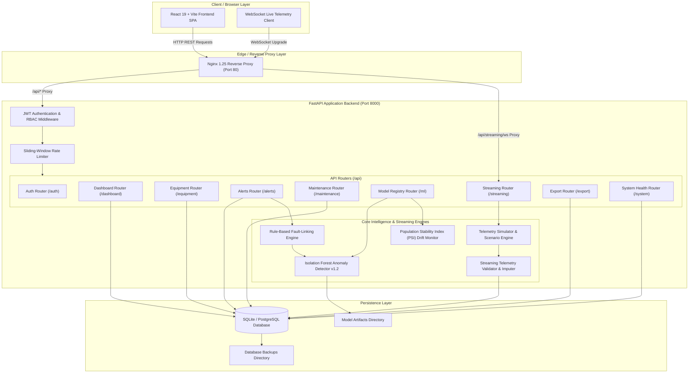

# EnergyIQ — System Architecture Diagram

## Description of Architectural Components

1. **Client / Browser Layer**: React 19 single-page application built with Vite, styled with Tailwind CSS, leveraging Lucide icons and Recharts. Connects to REST APIs via `fetch` and streams live telemetry via WebSockets.
2. **Edge / Reverse Proxy Layer**: Nginx 1.25 handles static asset delivery, SSL/TLS termination, HTTP-to-HTTPS redirect, `/api/` routing, and WebSocket HTTP upgrade header forwarding.
3. **FastAPI Application Backend**: Python 3.13 backend implementing stateless JWT authentication, PBKDF2 password hashing, RBAC permission checks, and sliding-window rate limiting.
4. **Core Intelligence & Streaming Engines**:
   - **Context-Aware Isolation Forest**: Detects energy deviations with rolling baseline comparison.
   - **Fault-Linking Engine**: Maps anomaly signals to 10 physical equipment fault categories.
   - **PSI Drift Monitor**: Computes Population Stability Index metrics across baseline vs current telemetry distributions.
   - **Telemetry Simulator & Scenario Engine**: Generates microgrid ticks and handles 10 degradation scenarios.
5. **Persistence Layer**: SQLite database (`backend/data/app.db`) with active migration pathway to PostgreSQL, model registry artifacts (`backend/data/models`), and automated hot backups (`backups/`).
